<div align="center">

# 🕌 BATASANAYA BACKEND API
### Intelligent Hijaiyyah Learning Platform Engine

[](https://lumen.laravel.com)
[](https://php.net)
[](https://mysql.com)
[](https://jwt.io)

<p align="center">
  <b>Batasanaya Backend</b> adalah core engine yang mentenagai aplikasi pembelajaran Hijaiyyah interaktif.<br>
  Dirancang dengan arsitektur RESTful yang <i>scalable</i>, sistem CMS multimedia canggih, dan mekanisme gamifikasi real-time.
</p>

<p align="center">
  <a href="#-fitur-unggulan">Fitur</a> •
  <a href="#-arsitektur-sistem">Arsitektur</a> •
  <a href="#-api-reference">Dokumentasi API</a> •
  <a href="#-instalasi">Instalasi</a>
</p>

</div>

---

## ⚡ Fitur Unggulan

### 🛡️ **Military-Grade Security**
- **JWT Authentication Layer**: Token-based auth yang aman untuk ribuan concurrent users.
- **OTP Verification System**: Verifikasi identitas real-time dengan expirable 6-digit codes.
- **Role-Based Access Control (RBAC)**: Segregasi total antara akses `User` dan `Super Admin`.
- **UUID Primary Keys**: Proteksi terhadap ID enumeration attack.

### 🎮 **Advanced Gamification Engine**
- **Multi-Game Tracking**: Support native untuk game *"Cari Hijaiyyah"* & *"Pasangkan Huruf"*.
- **Live Session Analytics**: Mencatat durasi main, percobaan (attempts), dan skor secara presisi.
- **Dynamic Progression**: Sistem unlock level otomatis berdasarkan pencapaian user di sisi server.

### 🎥 **Adaptive Multimedia Streaming**
- **HLS Video On-Demand**: Server otomatis mengonversi upload video menjadi format HLS (`.m3u8`) dengan multi-quality (**1080p, 480p, 360p**) untuk streaming lancar di semua kondisi sinyal.
- **Smart Asset Sync**: Mekanisme sinkronisasi aset cerdas berbasis `checksum` MD5, hemat kuota user hingga 90% saat update konten.

---

## 🏗 Arsitektur Sistem

```mermaid
graph TD
    Client[Mobile App / Web Admin] -->|REST API| Router[Lumen Router]
    Router -->|Middleware| Auth[JWT Auth Guard]
    Auth --> Controller[API Controllers]
    Controller -->|Read/Write| DB[(MySQL Database)]
    Controller -->|Process| Media[FFmpeg Engine]
    Media -->|Store| Storage[Public Storage]
    
    subgraph "Core Modules"
    Controller --> UserMgr[User Manager]
    Controller --> AssetMgr[Asset CMS]
    Controller --> GameEng[Game Engine]
    end
```



---

## 📚 API Reference

Base URL: `http://localhost:8000/api`

### 🔐 Authentication Module

| Method | Endpoint | Description | Auth |
| :--- | :--- | :--- | :--- |
| `POST` | `/auth/register` | Mendaftarkan user baru | - |
| `POST` | `/auth/login` | Login user untuk mendapatkan Token | - |
| `POST` | `/auth/admin-login` | Login khusus dashboard admin | - |
| `POST` | `/auth/request-otp` | Request kode OTP ke email | 🔐 |
| `POST` | `/auth/verify-otp` | Verifikasi validitas kode OTP | 🔐 |

### 👤 User Module

| Method | Endpoint | Description | Auth |
| :--- | :--- | :--- | :--- |
| `GET` | `/auth/me` | Mengambil profil user yang sedang login | 🔐 |
| `PATCH` | `/users/{id}` | Update data profil user | 🔐 |
| `POST` | `/user/profile-picture` | Upload avatar user | 🔐 |

### 📦 Asset Management (CMS)

| Method | Endpoint | Description | Auth |
| :--- | :--- | :--- | :--- |
| `GET` | `/assets/manifest` | **[CRITICAL]** Cek versi aset terbaru untuk sync | - |
| `GET` | `/assets/{id}/file` | Download file aset fisik | - |
| `POST` | `/assets` | **[Admin]** Upload aset baru | 🔐 |
| `POST` | `/videos` | **[Admin]** Upload & Convert video ke HLS | 🔐 |

### 🕹️ Game Data Engine

| Method | Endpoint | Description | Auth |
| :--- | :--- | :--- | :--- |
| `GET` | `/games/{type}/progress` | Cek level mana saja yang sudah unlock | 🔐 |
| `POST` | `/games/{type}/start` | Mulai sesi game baru (Generate Session ID) | 🔐 |
| `POST` | `/games/{type}/finish` | Selesaikan level & simpan skor | 🔐 |

> **Note**: `{type}` bisa bernilai `carihijaiyah` atau `pasangkanhuruf`.

---

## 💻 Panduan Integrasi Frontend

### 1. Smart Asset Synchronization Strategy
Jangan download semua aset setiap saat! Gunakan strategi ini untuk performa maksimal:
1. Panggil `GET /assets/manifest`.
2. Bandingkan `checksum` dari server dengan file lokal di device.
3. Hanya download file yang checksum-nya berbeda atau belum ada.

### 2. HLS Video Player
Server ini tidak menyajikan file `.mp4` mentah demi performa. Gunakan player yang mendukung HLS:
- **Flutter**: Gunakan `video_player` atau `chewie`.
- **Web**: Gunakan `video.js` atau `hls.js`.
- **URL Source**: `http://host/api/videos/{id}/file` (akan return file `.m3u8`).

---

## 🚀 Instalasi

### Persyaratan
- PHP 8.1+
- Composer
- MySQL 8.0
- **FFmpeg** (Wajib untuk fitur video)

### Quick Start

```bash
# 1. Clone Project
git clone https://github.com/username/batasanaya-backend.git

# 2. Install Dependencies
composer install

# 3. Setup Environment
cp .env.example .env
php artisan key:generate
php artisan jwt:secret

# 4. Migrate Database
php artisan migrate --seed

# 5. Create Storage Folders
mkdir -p public/uploads/{assets,profiles,songs,videos,backgrounds}

# 6. Ignite! 🚀
php -S localhost:8000 -t public
```

---

<div align="center">
  <p>Maintained by <b>Tim Batasanaya</b></p>
  <p>© 2024 All Rights Reserved</p>
</div>
